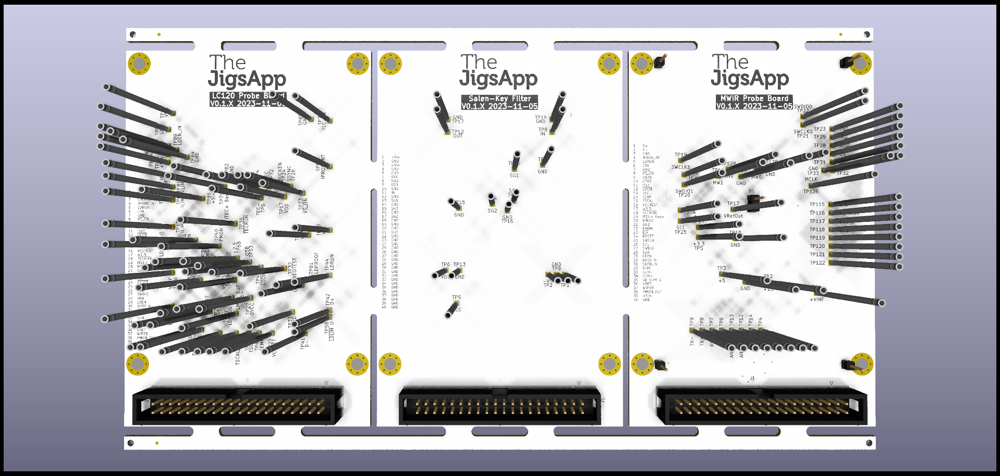

# kikit-multipanel

This repo includes a CLI tool, helper library, example presets, and example projects for using kikit for multiple designs in a single panel.

This should be able to handle correctly placed selections of different boards.
Some extra board sections will need to be added in if the panel has gaps that are too large.




[Installation](https://github.com/snhobbs/kikit-multipanel/blob/master/docs/installation.rst)

[Contributing](https://github.com/snhobbs/kikit-multipanel/blob/master/docs/contributing.rst)

[Usage](https://github.com/snhobbs/kikit-multipanel/blob/master/docs/contributing.rst)

   
# usage example
```sh
kikit_multipanel --fname panel.xlsx --out panel.kicad_pcb --preset_f preset.json
```

## Future Developments
+ Add a rectangular packing optimization to autoplace the boards.
+ Centroid file correction
+ Add checking for sections that will be cut off


## Notes
+ If the all outlines are not rectangles then vcuts will fail, mousebites need to be used
+ For multi board panels the boards need to be laid out to fit without large gaps.
+ Check the presets file your using by first using the kikit CLI with one of your boards
